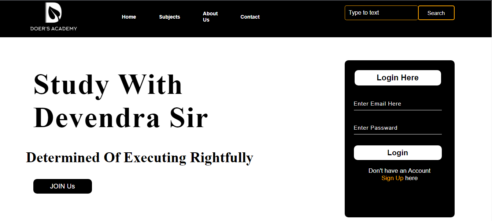
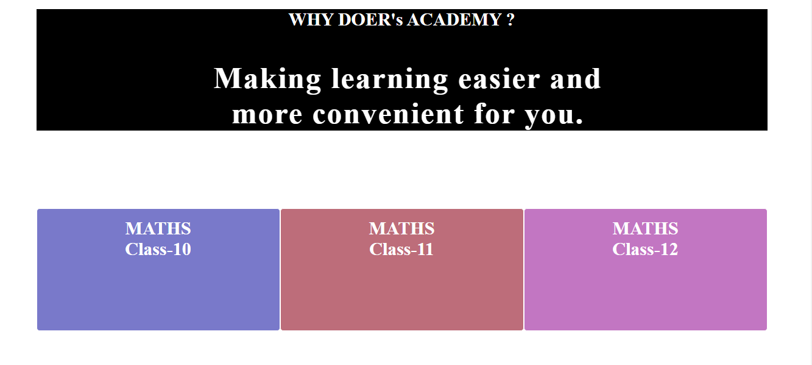
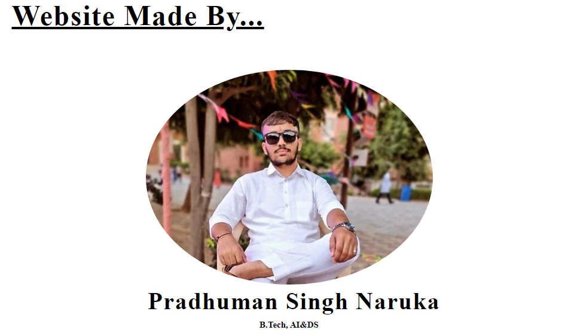
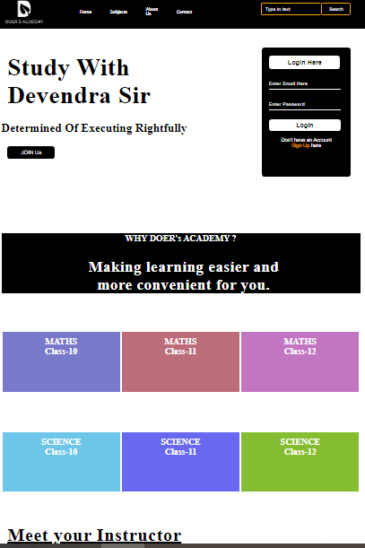

# Doer-sAcademy-Website-Project-1-
<h1 align="center">Explore our latest project on GitHub</h1>

<h3>The Doer's Academy Website is a HTML & CSS-based website. It aim to test my skills on HTML and CSS.</h3>

<h2>Key Features:</h2>
<h3>1.Education and Skill Development.</h3>
<h3>2.Help more Students.</h3>
<h3>3.Accessible to a global audience.</h3>
<h3>4.Continuous Learning.</h3>
<h3>5.Community Building.</h3>
<h3>6.Professional Development.</h3>

<h1 align="center">How to see a website</h1>

<h1 align="center">Phone View of Website</h1>

